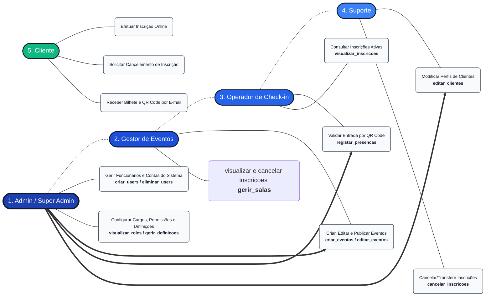

# Diagrama de Casos de Uso do Sistema

```mermaid
graph LR
    %% Definição de Atores (Incluindo o Cliente e Admin Total)
    Admin([1. Admin / Super Admin])
    Gestor([2. Gestor de Eventos])
    Operador([3. Operador de Check-in])
    Suporte([4. Suporte])
    Cliente([5. Cliente])

    %% Hierarquia de Perfis (Herança de Poder: Admin controla tudo)
    Admin -.- Gestor
    Gestor -.- Operador
    Operador -.- Suporte

    %% Casos de Uso - CLIENTE / PARTICIPANTE
    Cliente --- UC_Insc(Efetuar Inscrição Online)
    Cliente --- UC_Cancel(Solicitar Cancelamento de Inscrição)
    Cliente --- UC_Mail(Receber Bilhete e QR Code por E-mail)

    %% Casos de Uso - SUPORTE
    Suporte --- UC_E_Client(Modificar Perfis de Clientes<br><b>editar_clientes</b>)
    Suporte --- UC_C_Insc(Cancelar/Transferir Inscrições<br><b>cancelar_inscricoes</b>)

    %% Casos de Uso - OPERADOR DE PRESENÇAS
    Operador --- UC_Checkin(Validar Entrada por QR Code<br><b>registar_presencas</b>)
    Operador --- UC_V_Insc(Consultar Inscrições Ativas<br><b>visualizar_inscricoes</b>)

    %% Casos de Uso - GESTOR DE EVENTOS
    Gestor --- UC_M_Events(Criar, Editar e Publicar Eventos<br><b>criar_eventos / editar_eventos</b>)
    Gestor --- UC_M_Inscricoes(visualizar e cancelar inscricoes <br><b>gerir_salas</b>)

    %% Casos de Uso - ADMINISTRADOR (Controlo Total)
    Admin --- UC_M_Users(Gerir Funcionários e Contas do Sistema<br><b>criar_users / eliminar_users</b>)
    Admin --- UC_M_Roles(Configurar Cargos, Permissões e Definições<br><b>visualizar_roles / gerir_definicoes</b>)
    
    %% Ligações Diretas para provar que o Admin controla os casos de uso dos outros
    Admin ====> UC_M_Events
    Admin ====> UC_Checkin
    Admin ====> UC_E_Client

    %% Estilização Profissional de Cores
    style Admin fill:#1e40af,stroke:#0f172a,stroke-width:3px,color:#fff
    style Gestor fill:#1d4ed8,stroke:#0f172a,stroke-width:2px,color:#fff
    style Operador fill:#2563eb,stroke:#0f172a,stroke-width:2px,color:#fff
    style Suporte fill:#3b82f6,stroke:#0f172a,stroke-width:2px,color:#fff
    style Cliente fill:#10b981,stroke:#0f172a,stroke-width:2px,color:#fff

    %% Estilização dos Balões de Casos de Uso
    classDef uc fill:#f8fafc,stroke:#334155,stroke-width:1px,color:#0f172a,font-size:11px;
    class UC_Insc,UC_Cancel,UC_Mail,UC_M_Users,UC_M_Roles,UC_M_Events,UC_M_Salas,UC_Checkin,UC_V_Insc,UC_E_Client,UC_C_Insc uc;
```